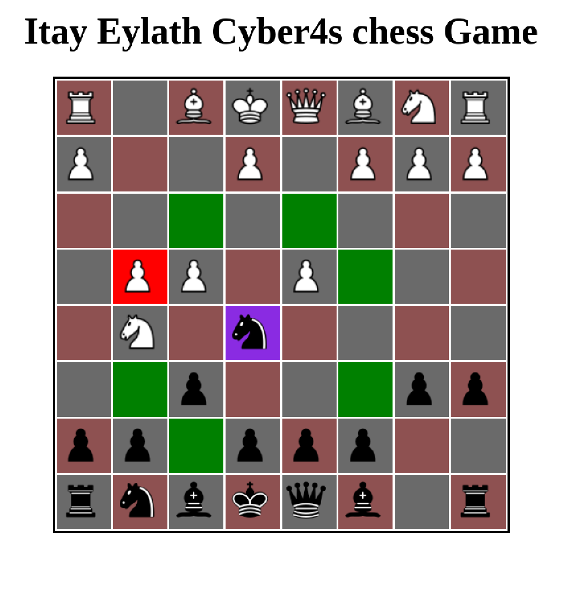

# Cyber4s

The <b>Cyber4s</b> is an elite Full Stack development program, intended to introduce
programming to ex-combat soldiers, while being mentored by industry
experienced seniors. The intense and thorough <b>6-month</b> boot camp has covered
modern full stack development tools. engaged in all development life cycle stages,
design (OOP), implementation and testing, all while working in small teams under
tight schedules, aiming to maximize knowledge and production.

## About my first project
After learning the basics (HTML, CSS and JS), we started the bootcamp project together led by the  lecturer, we received a task and then solved it together, this is how we built the game step by step.

